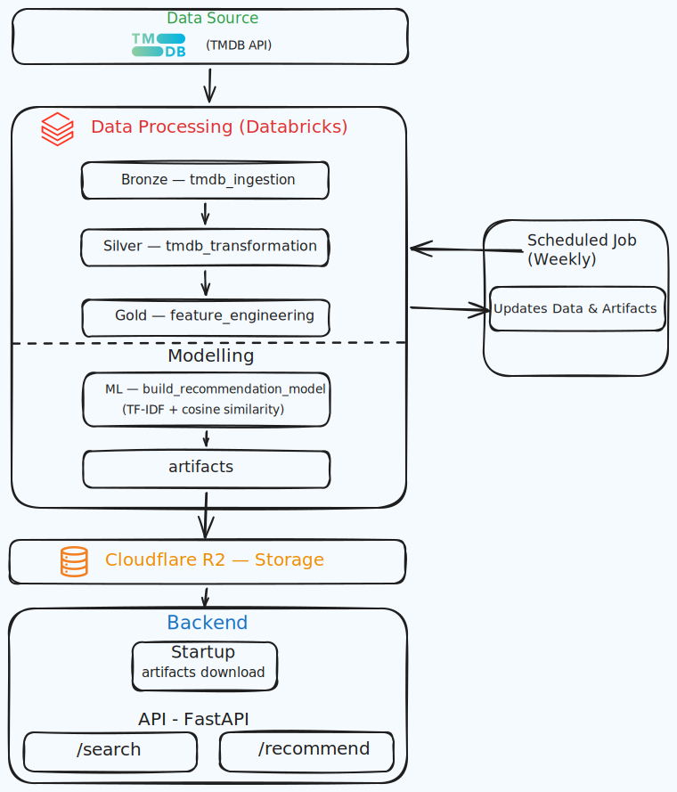

# 🎬 Movie Recommendation Pipeline

Pipeline completo de dados para recomendação de filmes utilizando dados da API do TMDB, processamento em múltiplas camadas e geração de artefatos para inferência eficiente.

---



## 📌 Visão Geral

Este projeto implementa um pipeline de dados end-to-end que:

- Coleta dados de filmes via API
- Processa e transforma os dados em diferentes camadas
- Constrói um modelo de recomendação baseado em conteúdo
- Gera artefatos prontos para consumo
- Publica os resultados em um storage externo

---

## 🎥 Fonte de Dados — TMDB API

O projeto utiliza a **TMDB (The Movie Database)** como fonte principal de dados.

A TMDB é uma base de dados colaborativa de filmes e séries que disponibiliza uma API pública para desenvolvedores acessarem informações sobre filmes

Os dados são retornados em formato JSON e utilizados como base para todo o pipeline.

---

## 🏗️ Arquitetura do Pipeline

O pipeline segue o padrão de camadas (Bronze, Silver, Gold), comum em engenharia de dados.

### 🔹 Bronze Layer (Ingestão)

Responsável pela coleta de dados brutos da API.

**Arquivos:**
- `01_tmdb_ingestion.ipynb`
- `02_info_movies_ingestion.ipynb`


---

### 🔹 Silver Layer (Transformação)

Camada de limpeza e padronização dos dados.

**Arquivos:**
- `01_tmdb_transformation.ipynb`
- `02_info_movies_transformation.ipynb`

**Função:**
- Tratar valores nulos
- Padronizar formatos
- Filtrar e organizar colunas relevantes

---

### 🔹 Gold Layer (Feature Engineering)

Camada onde os dados são preparados para modelagem.

**Arquivos:**
- `01_feature_engineering.ipynb`

**Função:**
- Criar features relevantes
- Combinar informações (ex: sinopse + gênero + palavras-chave)
- Preparar dados para entrada no modelo

---

### 🔹 DB Update

Responsável pela atualização periódica dos dados.

**Arquivos:**
- `tmdb_update.ipynb`

**Função:**
- Atualizar base de dados com novos filmes
- Manter pipeline sempre atualizado

---

## 🤖 Modelagem — Recomendação de Filmes

A modelagem é feita utilizando abordagem de **Content-Based Filtering**.

### 🔹 Arquivo principal:
- `01_build_recommendation_model.ipynb`

### 🔹 Técnicas utilizadas:

#### TF-IDF
Transforma os dados textuais em vetores numéricos, destacando a importância das palavras.

#### Cosine Similarity
Calcula a similaridade entre filmes com base nos vetores gerados.

---

### ⚙️ O que o modelo faz:

- Recebe os dados da camada Gold
- Aplica TF-IDF
- Calcula matriz de similaridade de cosseno
- Gera artefatos reutilizáveis

---

## 📦 Geração de Artefatos

O modelo gera artefatos que permitem recomendações rápidas sem necessidade de reprocessamento:

- Matriz de similaridade
- Índices dos filmes
- Dados transformados

Esses dados são serializados (ex: pickle) para otimizar performance.

---

## 🚀 Publicação — Pasta `publish`

**Arquivo:**
- `upload_r2.ipynb`

Essa etapa é responsável por enviar os artefatos para um storage externo.

**Função:**
- Fazer upload para o storage
- Disponibilizar os dados para consumo

---

## 📁 Estrutura do Projeto

```
movie_recommendation_pipeline/
│
├── bronze/
│   ├── 01_tmdb_ingestion.ipynb
│   └── 02_info_movies_ingestion.ipynb
│
├── silver/
│   ├── 01_tmdb_transformation.ipynb
│   └── 02_info_movies_transformation.ipynb
│
├── gold/
│   └── 01_feature_engineering.ipynb
│
├── ml/
│   └── 01_build_recommendation_model.ipynb
│
├── db_update/
│   └── tmdb_update.ipynb
│
├── publish/
│   └── upload_r2.ipynb
│
├── docs/
│   └── movie_recommender_stack.svg
```

---

## 📊 Arquitetura Visual

A arquitetura do pipeline pode ser visualizada no arquivo:

- `docs/movie_recommender_stack.svg`

---

## 📌 Conclusão

Este projeto demonstra um pipeline completo de engenharia de dados aplicado a recomendação de filmes, cobrindo desde ingestão até publicação de artefatos, com foco em organização, escalabilidade e performance.
